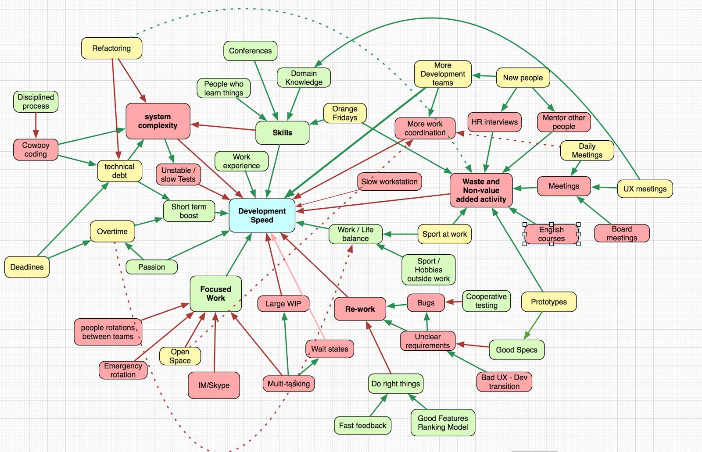
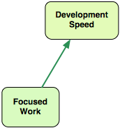
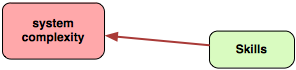

# 軟體開發速度模型

讓我們從概要開始。我馬上就要嚇著你了。這張圖看起來確實很嚇人，但耐心聽我說，我會解釋它的每一小塊。最終你將會有個分析類似問題的強大工具。

這張圖表顯示了以某種方式影響開發速度的事物或活動。綠色表示一個會提升速度的活動。你有越多越好。黃色表示存在某種最大值。例如，你能夠累積技術債並提升速度，但若是你累積得太多了，它就會明顯地拖慢你。紅色顯示了拖慢開發的東西，你有越少越好。接下來。綠色箭頭表示提升影響。舉例來說，專心工作增加開發速度。

紅色箭頭表示降低影響。舉例來說，更好的開發技能會降低系統複雜性（好的工程師建立比較不複雜的系統）。

現在你可以看看這張圖表，並提出像這樣的問題：什麼會提升開發速度？什麼會降低它？我們能做些什麼來更快（或更好！）地創造軟體？模型可能並不完美，但這還行。你可以自由修改它。

現在我要解釋模型的不同部分、分析它們、並提出一些關於開發速度的見解。我希望它會是一個更深入地思考這個問題、並產生更多解法的好的開始。讓我們開始吧。
