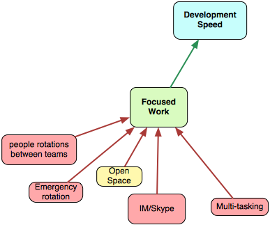
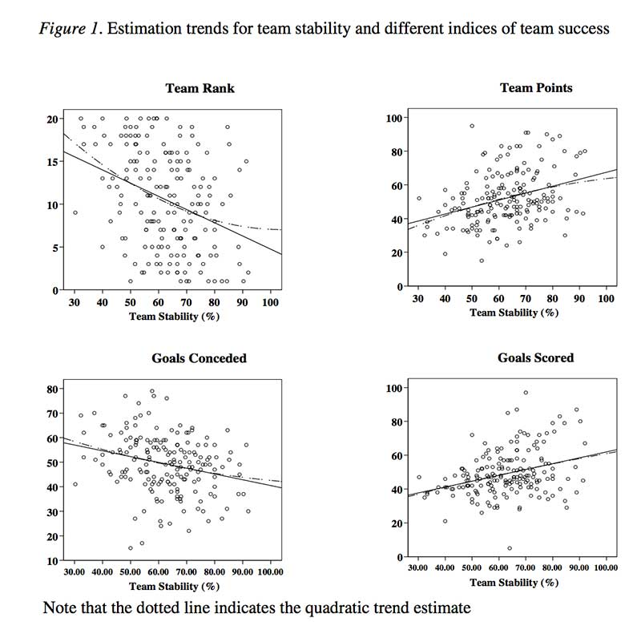
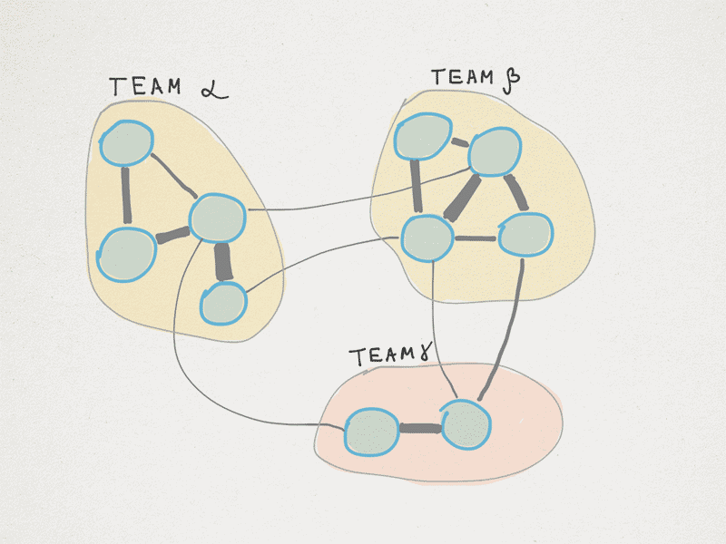
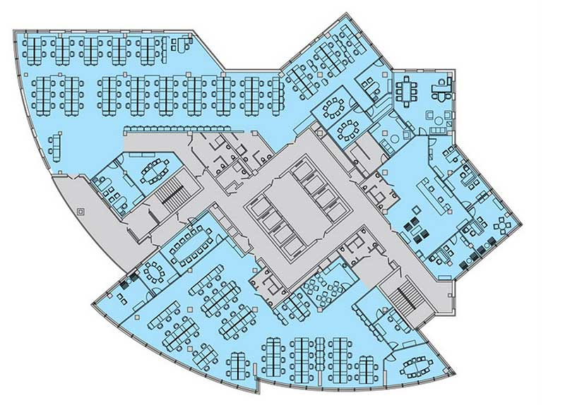
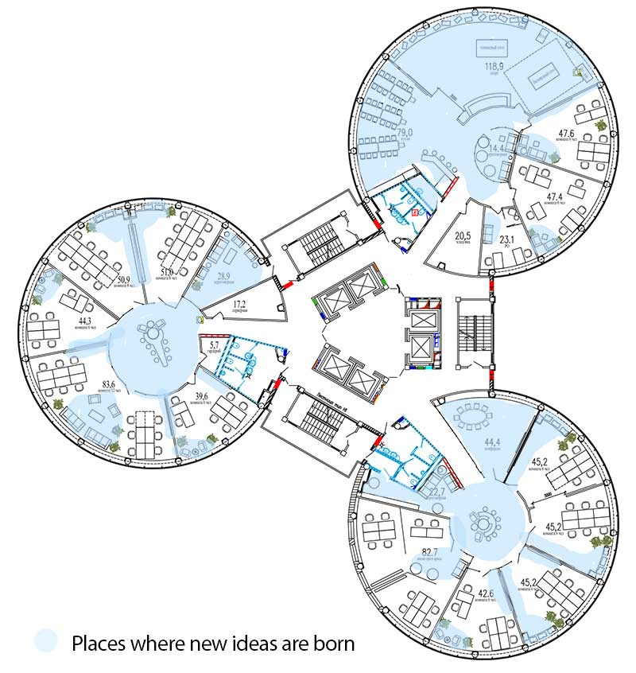
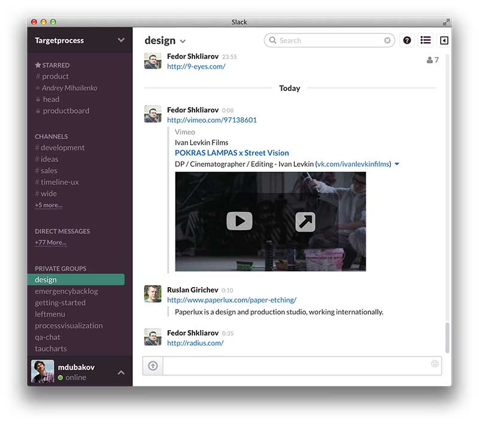
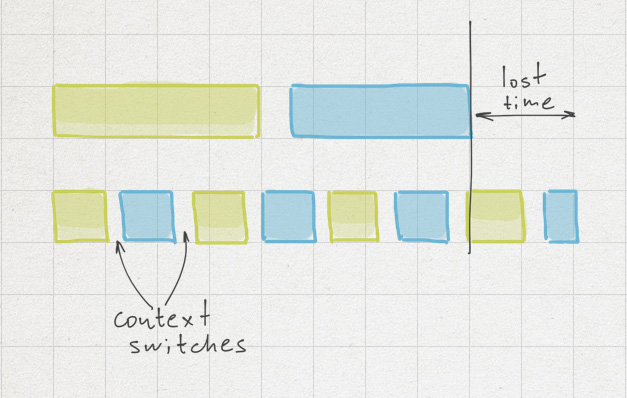

# 專心工作

每天你會有多少干擾？軟體開發需要非常集中與專注。程式設計師在他們的心中建構巨大的模型，每一次的干擾都可能破壞模型狀態，所以要花時間重建它。

專注工作削減了所有浪費的活動，並幫助開發者深入[心流（flow）](http://en.wikipedia.org/wiki/Flow_(psychology))。讓我們來檢閱是什麼令人們從專注狀態中分心的。

## 不穩定的團隊／人員輪調

團隊的穩定性如何影響生產力是非常不明瞭的。直覺上，我們可能會認為穩定的團隊表現較好。在這種情況下，我們的直覺是正確的。由 Rally 完成的研究指出：

> 「長期保持團隊完整，結果是 60% 生產力的提升；團隊更為可預測且更具反應能力。」

為何會這樣？每個團隊都有個生命週期。Tuckman 定義了團隊開發的 4 個階段：成形 - 動盪 - 規範 - 執行。顯然，一個團隊在最後一個階段––執行––是最有生產力的。若是你輪調團隊成員，你就破壞了團隊，而這些階段全都會再一次重複。然後再一次。然後再一次。在最糟的情況下，會沒有像規範與執行階段這樣的事情，只會持續因輪調而產生的動盪。

思考[結對程式設計（pair programming）中的結對輪調](http://lmsgoncalves.com/2013/09/09/enable-pair-programming-rotation/)是很有趣的。開發者每天都以不同的結對工作。這樣真的好嗎？我們在 Targetprocess 嘗試過，糟透了。現在我理解為什麼了。首先，有一些個人偏好，有些人在某些結對中非常沒有生產力。其次，當你每天輪調的時候，很難快速建立一個良好的關係。事實上，你拉長了上面提到的全部 4 個階段，而真正的執行階段可能永遠不會發生。所以我並不喜歡結對輪調。

穩定的團隊在其它領域的表現如何？足球怎麼樣？這裡有一份迷人的研究：[足球團隊中的穩定性與表現（Stability and Performance in Football Teams）](http://www.professormarkvanvugt.com/site-oud/publications/stabilityfootmvv.pdf) (pdf)。結論非常清楚：

> 「這些研究結果表明，穩定性可能透過提升認知與身體協調，促進了團隊在專業足球運動中的表現。」

大約一年前，我們決定組成四個穩定的團隊。他們工作了三個月，顯然兩個團隊是可以的，但其它兩個團隊並沒有成形，而且他們的生產力很普通。我們決定重組這兩個團隊。回頭來看，這是個非常好的決定。現在四個團隊都在規範階段展現了良好的生產力，但花了數個月來克服動盪階段。

## 開放式空間

我不喜歡開放式空間。當周圍持續在嘰嘰喳喳的時候真的很難以專注。如同我們已經討論過的，穩定的團隊比較好。穩定的團隊相當獨立，而且不會非常大。在我們公司，一個典型團隊的大小為 6 個人。這個團隊內部的溝通非常密集，然而不同團隊之間的溝通則沒這麼密集。

這表示每個團隊都應該有一個獨立的空間（有牆）。

這是一個典型的開放式空間。一大塊地方有許多人。你會聽到來自四面八方的聲音。有人經過，而你無可避免地在短暫的時刻轉移了你的注意力（人們傾向注意移動的東西，這來自我們的古老本能）。電話響了。某人嘎扎嘎扎地弄響餅乾包裝。發生了熱烈的討論，並在桌子之間傳開。人們在你的工作地點附近跟其它人打招呼。聽來很熟悉嗎？在這裡很難專心。要專注的唯一方法就是戴上你的耳機，然後讓音樂很大聲......再大聲......非常大聲......喔幹我的老天！我要去買那些[昂貴的抗噪耳機](http://www.bose.com/controller?url=/shop_online/headphones/noise_cancelling_headphones/quietcomfort_15/index.jsp)。立刻就買！

現在[將這與 6-8 人作為一個團隊一同工作的小房間相比](https://www.targetprocess.com/blog/2013/02/hello-new-office-bye-bye-old-office.html)。電話沒那麼常響了。周圍的聲音比較少了。大多的討論都非常重要，[滲透式溝通](http://alistair.cockburn.us/Osmotic+communication)起作用了，終於。

我認為這個配置是最好的了。私人辦公室確實能夠最大限度地專注。然而，它破壞了溝通。人們懶得起身再走去問問題。假如你能迅速問個問題，這會造成很大的不同。在我看來，**「團隊大小的空間」是我們所能達到的最佳平衡**。

## IM／Skype／通知／等等

通訊服務與不同的通知可能被無情地稱作「專注吸取者（focus sucker）」。右邊角落跳出了什麼東西，你移動了你的眼球來檢查它。專注沒了。Skype 圖示上出現了紅色氣泡，而你與打擾你並迫使你打開 Skype 檢查訊息的急迫感奮鬥。專注沒了。我打賭你沒注意到這些干擾。它們很細微而且長期不斷，它們被植入你的日常流程中。事實是這些細微干擾危險到足以把一個有生產力的一天轉變成沒生產力的一天。你查閱、回覆、嘗試專注、再次查閱、再次回覆、嘗試專注 — 一天結束時，你有的只是幾封回覆的電子郵件、許多 skype 討論、幾乎沒幾行程式、以及無盡的嘗試專注。

如何對抗這點？當你真的打算專注並寫什麼程式時，關掉郵件、關掉 Skype、關掉所有的通知服務。查看 Twitter 上的新回覆或是 Facebook 上的新狀態更新是必要的嗎？我確信不是。閉嘴吧。

這聽來容易，但嘗試這麼做，你會發現這個習慣難以改變。你會突然想要問什麼事、再次打開 Skype、問問題、不關掉它然後被新的通知打斷。我確實瞭解這點，因為我自己也有這個問題。

在我們公司，我們 Skype 用得很兇。有許多的聊天群組。每個團隊都有一個聊天室。我們有全公司的聊天室、產品聊天室、銷售聊天室、營運團隊聊天室、支援聊天室、UX 聊天室、等等。

看起來它們全都需要，但訊息量太龐大了。我不知道如何在系統層面上解決這個問題。我們需要那些溝通管道，但我們每天都為持續的干擾付出高昂成本。

優秀的溝通管道是非常有針對性的。最好的情境是，當一封訊息被真正需要的人收到時，他們能夠以某種方式做出反應。然而，定義這一群人並沒有這麼容易。更多較小、針對的聊天室或許會比許多通用的聊天室還要好。最近我們轉到 Slack。它有更好的通知系統，並且比較不擾人，但仍有聊天室造成的本質負擔。

## 多工

有兩種類型的多工：在你一邊寫程式一邊講電話的時候、以及在你有許多要完成的任務，並且從一個任務切換到另一個任務的時候。第一種顯然是件壞事。第二種也不好，但我們仍然會多工。我個人每天都得做好幾個任務。我知道我不該這樣，但我到目前為止都無法更好地專注。情境切換（context switch）容易扼殺生產時間：

如何解決這個問題？情境切換應該減到最小。最好的情況是，進行單一任務直到完成，並且只在這時切換到一個新的任務上。說起來很簡單，做起來很難。我認為這裡有些技巧能夠幫助我們。有科學證實[冥想是有幫助的](http://faculty.washington.edu/wobbrock/pubs/gi-12.02.pdf) (pdf)。

一個可行的替代方案是將工作切塊。我已經聽過許多人以[番茄鐘工作法（Pomodoro technique）](http://pomodorotechnique.com/)達成了不錯的結果（但我到目前為止都還沒試過它）。
