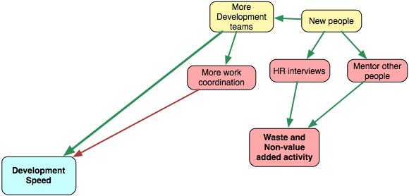

# 更多人／更多開發團隊

大公司總是工作得更快、釋出得更快。對嗎？不完全是。小公司有比較好的單位速度，而大公司有比較好的整體速度，但通常這會讓它們付出代價。讓我們以一個團隊（6 人）為例，並將它擺進兩間不同的公司裡。我保證這個團隊在一間小公司會工作得比較快。但在一間大公司裡頭有數十個團隊，所以整體開發產出會更高。

試著維持很高的單位速度，對於成長是比較好的。更多人意味著更多協調、更多會議、更多浪費。

## 招聘 {#hiring}

新人組成新的開發團隊，並且長遠來看提升了開發速度。然而，這個流程無可避免地降低了當前的開發速度。首先，某些開發者會被技術面試分心。假使你嘗試要招聘優秀的人員，就會有許多面試，而大多數都不會有什麼結果。我認為一次招聘會花上 10-40 小時面試。

其次，新人應該要被指導。某人應該要協助他們理解在這東西是怎麼運轉的。這個流程花費 1-3 個月，而在這段期間，開發者不會非常有生產力。我認為 6 個月後，人們才能開始全速工作。

這意味著什麼？若是你有個重要的緊迫期限（讓我們假設，剩下 6 個月） — 別聘人，它會拖慢你。若是你沒有期限，並且準備好在今日減速以在明日加速 — 就開聘吧。

要思考的有趣問題是：我們能在不讓開發者分心的情況招聘新人嗎？我們能將技術面試取代成別的什麼嗎？如何花更少的時間在指導上，但有相同的效果呢？

## 工作協調 {#work-coordination}

大公司並不是非常有效率。更多的人需要更多的協調。通常，解決方法是更多的管理層級、更深的階層架構、更多的會議、更多的政治遊戲、更少的生產時間以及一般的開發速度。

我不喜歡很深的階層架構。我喜歡擁有自主跨職能團隊（cross-functional team）的網路與平坦的組織。

在 Targetprocess，我們有 5 個完全獨立的開發團隊。每個團隊包含功能負責人、開發者、測試人員與設計師（通常他們是共享的）。團隊對功能實作負全責，並且做出一切關於功能的重要決策。

問題是產品本身應該要模組化到足以支持獨立團隊。模組之間的關聯應該要盡可能少，否則整合將會是個問題。Targetprocess 仍未做到這點。

### 旁註

公司架構會被複製到產品架構中。舉例來說，我很想比較 IBM 與 Atlassian 中的產品架構。IBM 是否使用了很深的繼承模型？Atlassian 是否更依賴於關聯與組合？靈活與扁平的公司或許會創造靈活的產品。假如是這樣的話，那麼一間公司的結構會對一個產品的成功有著巨大的影響。
