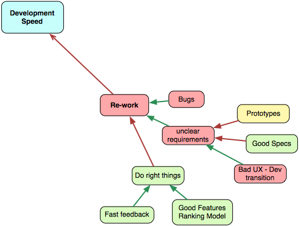
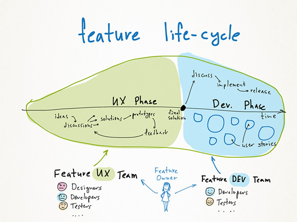
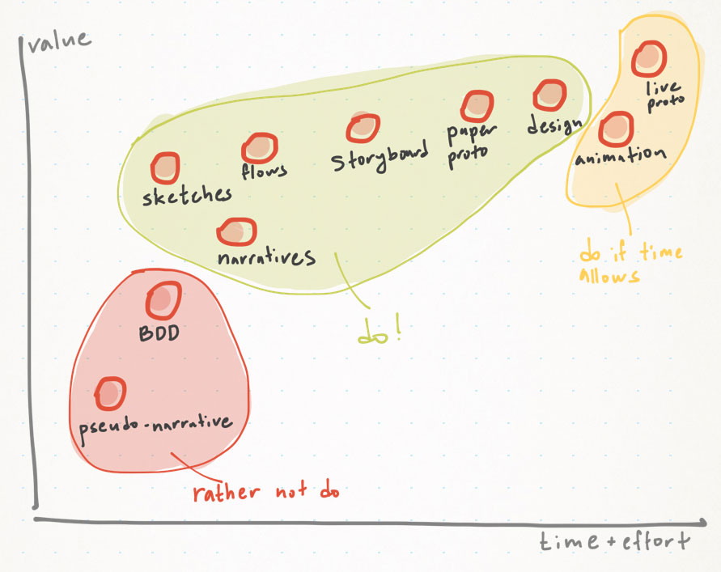

# 重工

任何重工都肯定會降低開發速度。完全不重工是不可能的，但我們可以試著盡量減少它。

有三種重工的主要來源：

- 臭蟲
- 不明確的需求
- 完成了錯誤的事情

讓我們從臭蟲開始。

## 臭蟲

我無法想像沒有臭蟲的軟體開發。開發者不喜歡測試他們的程式，而且他們大多[無法精於測試](http://qablog.practitest.com/2010/05/why-cant-developers-be-good-testers/)。開發中的臭蟲是無可避免的，而測試人員與開發者合作，以盡早發現並修復它們。

早點找出臭蟲是很重要的。在這種情況下，開發者有關於程式的鮮明記憶，而且最有可能快速修復臭蟲。若是你有個很長的測試週期（超過一週），可能會嚴重地降低臭蟲修復的速度。一週是足以遺忘程式的某些部份的，情境切換會善盡它的職責。

修復產品中發現的臭蟲是最昂貴的。通常，你會因為一些古怪的行為收到一封來自客戶的電子郵件、花費一些時間溝通、重現臭蟲並將臭蟲加到待辦清單中。接著某人會為這隻臭蟲定優先次序、詢問更多細節。接著開發者修復臭蟲、再次與測試人員溝通、等等。在產品中發現一隻臭蟲的簡單事實造成了**巨大的間接成本（overhead）**。

## 不明確的需求

大多臭蟲由不明確的需求所致。開發者通常會閱讀規格、問問題並開始實作。規格中常常會有不清楚的敘述。開發者常常不會發現。產品負責人常常不能立即回答問題，所以開發者必須根據經驗猜測。他們的猜測常常是錯的，導致重工。讓我們簡單介紹一下最顯著的解決方法。

### UX 到開發的過渡

首先，開發者應該理解功能的情境。你無法就這樣把 THE SPEC 拋給他們，然後等著下個月的最終解法。開發者必須理解客戶面對的真實問題、以及為何這些問題要以規格中描述的方法解決。有許多解決這個議題的方法。

- 開發者能夠從一開始參與 UX。這會幫助他們理解業務是怎麼運作的、以及為何提出的解法很好。
- 每個功能或者使用者故事都可能有一個「啟動會議（kick start meeting）」。會議的目標是讓所有人意見一致：開發者、測試人員、產品負責人。功能或使用者故事會被詳細討論。檢驗可能的失敗案例、開發者詢問他們的問題。我們有這種會議，而它們就像是一種魔法。一個解法經常會在一場啟動會議期間改變！
- 撰寫良好的規格（不可能！）。

### 規格

良好的規格是很罕見的。良好的規格明顯有助於更好地理解解法、降低臭蟲數量、減少重工並節省時間。

我寫過一篇[長文來討論為何很多規格都爛透了，以及如何改進它們](https://www.targetprocess.com/articles/visual-specifications.html)。簡而言之，有許多描述與解釋的方法。下面的圖表顯示了這些方法。X 軸顯示了建立一份規格所需的時間與精力。顯然一個會動的雛形比起畫草圖還要費力。Y 軸顯示了技術價值。偽敘述（pseudo-narrative）規格沒什麼價值，而設計與雛形則非常有用。

## 做正確的事

臭蟲很糟，但一個沒有人使用的功能怎麼樣呢？想像一下？你花在設計、實作並測試的所有時間都是一種浪費。我個人在 Targetprocess 設計並實作了許多幾乎沒人使用的功能。

如何做正確的事情？沒有簡單的答案，很難確切地知道客戶真正想要什麼。講出他們真的會使用什麼就更難了。但你仍然有許多能更好地理解客戶需求與優先次序的事情。

### 溝通管道

為客戶提供極其簡單的方法來提供回饋。要為這個目的找到好的服務是很簡單的，像是 UserVoice 或 Desk.com。

### 使用統計

如何知道哪個功能很受歡迎，而哪個不是呢？隨著每次功能實作，思考使用指標是很有幫助的。我們要如何知道這個功能是成功的？有多少人每天／每週使用它？這些指標將有助於驗證像是「我們相信我們使用者的 50% 會每天使用這個功能」這種最初的假設。因此，你會從錯誤中學習，並在未來做出更聰明的決定。

### 功能順位模型

你要如何知道接下來要作哪個功能？產品負責人的直覺很可能不是挑選功能的最佳方法。[簡單的線性模型勝過專家](http://lesswrong.com/lw/3gv/statistical_prediction_rules_outperform_expert/)，所以使用它們吧。建立一個簡單的模型、以模型排序功能、在許多功能上證實它、修正它、然後相信它。我們在 Targetprocess 花了幾個月在功能順位模型上。我們檢閱了許多來源、討論優先次序、從客戶那累積回饋、最終建立一個每個人都信仰的良好模型。

當我們加上所有功能與所有參數、並計算分數時，看來我們的直覺對於其中的大部分已經做得足夠好了，但有許多令人吃驚的功能跳到了頂端。我們討論它們，並發現了一些改變我們對這些功能看法的晦澀屬性。我不想在這裡深入太多細節，僅提供一個公式：

<pre>
功能分數 = 30% * 賣點
         + 15% * 使用範圍
         + 15% * 客戶投票
         + 15% * 功能大小
         + 15% * 痛苦
         + 10% * 使用頻率
</pre>

最大的功能分數為 100%。看來，我們正在做的主要功能位在清單的中間。它們並沒有我們想的那麼重要。不過，我們完成了這些功能。你知道怎麼了嗎？這些功能的最初反應非常冷淡。沒有那麼多人真的照我們預期的那樣使用它們。現在我們正在做清單中最上頭的功能，我相信它們將會是最被客戶所歡迎的功能。

### UX 回饋

從客戶那收到所有主要功能與 UX 更動的回饋是很值得的。建立雛形、分享草圖、執行 A/B 測試、累積資料並分析它。

我會說如果你解決這個問題，你將會大大地減少重工。
