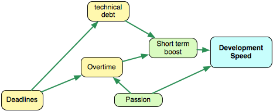

# 短期推進（boost）

有時候是完全有必要在短期內推進開發的。例如，你有一場重要的展覽會，或者一位重要的客戶堅持要在一個特定的日期釋出。從業務的觀點，拿品質去換速度可能是沒問題的。

你應該理解[天下沒有白吃的午餐](http://en.wikipedia.org/wiki/There_ain't_no_such_thing_as_a_free_lunch)。短期的速度推進可能導致長期的減速。

## 期限 {#deadlines}

期限設定了一個目標，並且在大部分情況中，這個目標是釋出新功能。我從未聽過一個像「我們絕對得在 6 月 13 日之前償還全部技術債的 40%」或「我們應該在 6 月 13 日之前美化內部架構」這樣的期限。我聽過的期限是像「我們應該在 4 月 11 日前釋出 v.3。不允許延誤」。期限強加了時間壓力。時間壓力迫使我們專注在期限目標 — 功能。這導致了更高的技術債與更多的複雜性。顯而易見。

此外，期限經常像是一個把「把鳥事搞定（Get Shit Done）」模式打開的開關，像是「我們是英雄！我們要釋出這個版本，不然就他X的去死！」。GSD 模式增加了更多的技術債。所以期限能用以短期推進，但要非常小心。

### 期限與迭代開發

現在我要跟所有熟悉敏捷軟體開發的人分享一個相當有爭議的想法：**迭代開發是一組微期限（mini-deadline）**。確實，時間盒（timebox）意味著我們必須在一次迭代的結尾之前完成一組確定的工作。考慮一下這點。這是否暗示著與痴肥期限相同的後果？不全然，但類似。若是一個團隊在衝刺（sprint）#4 中承諾了 9 個使用者故事，它會試著完成所有的工作。正確的解決方法是縮小範圍，放棄無法以良好品質完成的故事。但舉例來說，Scrum 需要承諾，於是造成了心理壓力。人們開始偷工減料。當然是在很小的規模上，但仍是如此。它並不總是不好的，如同我們已經知道的，但意識到這個適得其反的副作用是很好的。

## 加班 {#overtime}

提升整體生產力的一個明顯而簡單的（唔......）方法是工作得更多。藉由多工作幾個小時，我們能夠完成更多東西，並且更早釋出。對嗎？Jason Fried 認為這個方法完全錯誤：

> 「這種工作狂熱不只不必要，而且愚蠢。工作得更多不代表你在乎的比較多、或者做完的比較多。它只代表你工作得比較多。工作狂到頭來創造了比他們所解決的還多的問題。首先，像這樣工作無法長時間維持。當倦怠崩潰襲來時––它會的––會更難達到。」

平衡的視角指出，一些加班時間是可以的。當你試著加快一版釋出，並準備好最後衝刺時 — 以 20% 的加班時間工作 2-4 週還行。但長遠來看，這種作法會失敗，反作用是無可避免的。

我們不會在 [Targetprocess](https://www.targetprocess.com/) 加班。絕不。唯一極為罕見的例外是在我們碰上我們的產品伺服器掛點、或是有一些阻礙性錯誤（blocking bug）存在的時候。

Klint Finley 寫了一篇[非常有趣且深入的關於加班的文章](http://devopsangle.com/2012/04/18/what-research-says-about-working-long-hours/)。看看吧。

## 熱情 {#passion}

熱情很好。熱情的人非常在乎他們的工作。他們盡其所能地撰寫良好的程式、發明優秀的解法、並推動事物發展。每位雇主都想要擁有盡可能多熱情的人。

不過熱情並非全然正面。熱情的人傾向工作得更多並且在找到工作／生活的平衡這點上[吃盡苦頭](http://programmers.stackexchange.com/questions/129412/are-passionate-programmers-more-prone-to-burnout-than-others)。[倦怠](http://tech.onthis.net/2011/06/16/top-10-symptoms-of-developer-burnout/)是很實際的，所以維持在平衡狀態要好得多了。否則，你可能會有健康問題、[心理問題](http://sd.jtimothyking.com/2009/04/17/depression-and-the-software-developer/)、家庭問題以及抑鬱症。

熱情很好，它加速了專案，但它應該由一些非工作活動來平衡。
