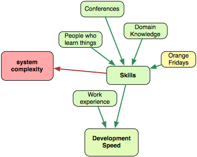
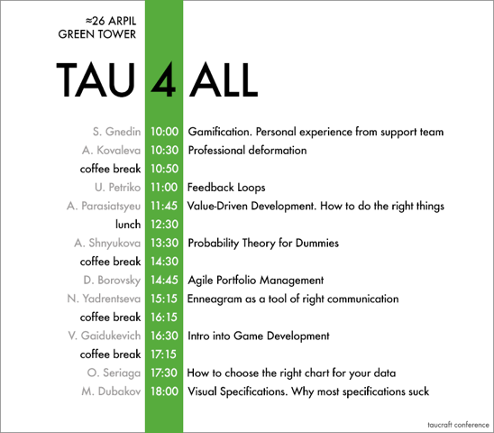
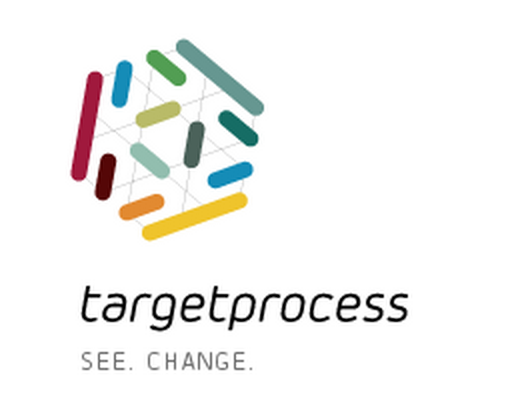

# 技能與經驗

技能提升開發速度是非常顯而易見的。更多熟練的開發者會更快地解決問題、並且建立較不複雜的解決方法。某些人認為，非常熟練與較不熟練的開發者之間可能是 10 倍的生產力差距。不過，我不認為這是個常見的情況。

下個瑣碎的問題是，能做些什麼來提升開發者的技能呢？首先，你可以只聘請有經驗的開發者。這或許行得通，但這種模型並不容易延展。有經驗的人傾向處理需要他們技能的困難問題。世界上有多少公司處理的是真正困難的問題？沒那麼多啦。另一方面，若是你的產品並非難事，你也不會需要充滿 PhD 開發者的團隊。所以任何公司的技能都是不同的。一位 Google 的熟練開發者並不等於一位外包公司的熟練開發者。

好的，你為你的公司定義了熟練的開發者，但找到許多這種人仍舊艱難。可延展性的問題還是存在。所以你也必須聘請沒那麼熟練的開發者才能成長。這還行，但絕對要聘請想要學習新事物的人。無論是誰，假如不喜歡學習的話，要怎麼獲得技能呢？好奇心、活潑的心靈、熱情 — 這些優點是最主要的。

一間公司應該提供它能幫助人們學習的任何東西。下面是一些選項：

### 買任何人們所要求的書

任何公司都該有間[好圖書室](https://www.targetprocess.com/blog/2014/02/our-library.html)。我所知的大多優秀開發者都會大量閱讀。沒有強迫人們讀書的方法，但至少應該要非常容易前往、並取出一本好書閱讀。

### 把人送到研討會去

許多人認為研討會是一種新知識的來源。或許吧，但我將它們當作熱情原動力（passion-drivers）。研討會促使你持續學習、持續嘗試新事物、並且在最好的情況下，給你一些方向。

我喜歡參加對我而言是新鮮的那些主題的研討會。例如，當我開始學習使用者經驗（User Experience）時，我參加了兩場大型研討會。第一場尤其有用，第二場就沒那麼好。

### 組織讀書會

學東西的其中一種最好方法是，寫一本關於這個主題的書。較不極端的方法是準備一場分享會或是一個工作坊。一間公司應該組織內部研討會，以推進這個流程。不是每個人都準備好在觀眾中講話，但許多人會想試試。在我們公司，[我們每 6 個月有 2 天的研討會](https://www.targetprocess.com/blog/2013/03/time-for-tau-conf-5.html)。沒有外部講者，所有的議程都是由我們的團隊成員所準備的。

另一個好做法是提供一個多種社群聚會的空間。我們有個容納至多 80 人的小研討室，並且樂意收容在地 UX 社群、.NET 社群與 iOS 社群。

肯定還有其它舉辦內部活動的方法。

### 提供學習新事物的時間

這聽起來不像是個強制的做法。或許不是吧。儘管如此，若是一間公司提供一些僅獻於學習的自由時間 — 那真是太棒了。Google 著名的 20% 時間是個好例子（有[傳言](http://www.huffingtonpost.com/2013/08/16/google-20-percent-time_n_3768586.html)說這個做法已經取消了，但這些傳言並沒被證實）。在 [Targetprocess](https://www.targetprocess.com/)，我們有 Orange Fridays。

每週五都專門用在個人專案或學習上。許多人上 Coursera 課程、閱讀文章、檢驗新科技。衡量這種作法的有效性是不可能的，但有許多優點：

- 事實上，這意味著一週工作四天。至少第五天並不是個平常的工作天。
- 吸引了喜愛學習的人，所以對招聘來說是個很大的加分。
- 更容易留住人，因為他們有靠他們自己嘗試新事物的選擇權。
- 人們更快地獲得新技能。

只有一個缺點 — 它很可能會降低整體的開發速度。人們一週少工作一天，是對開發速度 20% 的直接打擊。哪個更重要？看情況。假如你離釋出非常近了，在戰術上，將每週五花在教育上就不太明智。假如你處於馬拉松模式 — 很可能是值得的。

#### 不要臉的廣告

我在 Targetprocess 工作 — 一套非常酷的視覺化專案管理軟體。假如你因為 Scrum、Kanban 或是其它專案需要一套敏捷工具，[試試它吧](https://www.targetprocess.com/product)。

### 協助人們更好地理解領域（domain）

領域知識對於任何軟體開發者都是至關重要的。它有助於更深入地理解問題、更快地創造更好的解法、並且減少重工。它令開發者能夠更早發現爛解法。少了領域知識，開發者會盲目地實作一套由業務分析師或產品負責人的解法。有了好的領域知識，開發者便能夠靠他自己輕易地創造出色的解法、或者作為 UX 團隊的一員來集思廣益解決方法。

領域知識在產品開發中尤其重要。人生短暫，深入地學習許多領域很難。所以專注是一件好事。你最好找到驅使你、並弄髒雙手的東西。

好的。現在讓我們稍微談談經驗。

## 經驗 {#experience}

大多情況下，工作經驗也會影響速度。一位有著 20 年經驗的開發者，解起問題通常會比一位有 5 年經驗的開發者還快（即使他們不知怎麼的擁有相同的技能）。不過，注意到技能並不等同於經驗。你能夠擁有許多用於全然無關技能的經驗，而不能夠解決公司面臨的大多數問題。

我個人認為，在開發速度的改進上，技能是最有影響力的因素。若是你有一群有技能的開發者、設計師、與測試人員 — 他們有很大的機會會創造出一些好東西。假如你只有新手開發者 — 幾乎沒什麼能幫忙提升開發速度。

許多公司都有一大堆問題：有一些很簡單、有一些很有挑戰性。沒經驗的開發者會對所有事物充滿熱情，幾乎任何問題都會帶給他們一些新知識。有經驗的開發者比較挑剔，最好給他們足夠複雜的問題。所以，在公司內部擁有許多有技能／有經驗的人是很好的，但平均技能等級應該要高。對於每間公司，良好的平衡都是獨一無二的，但至少要思考這個問題。
