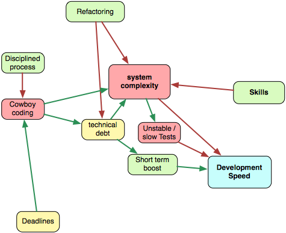
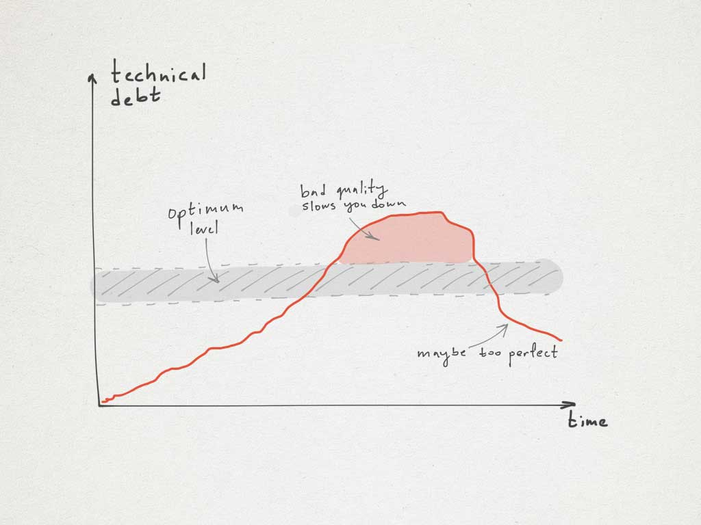
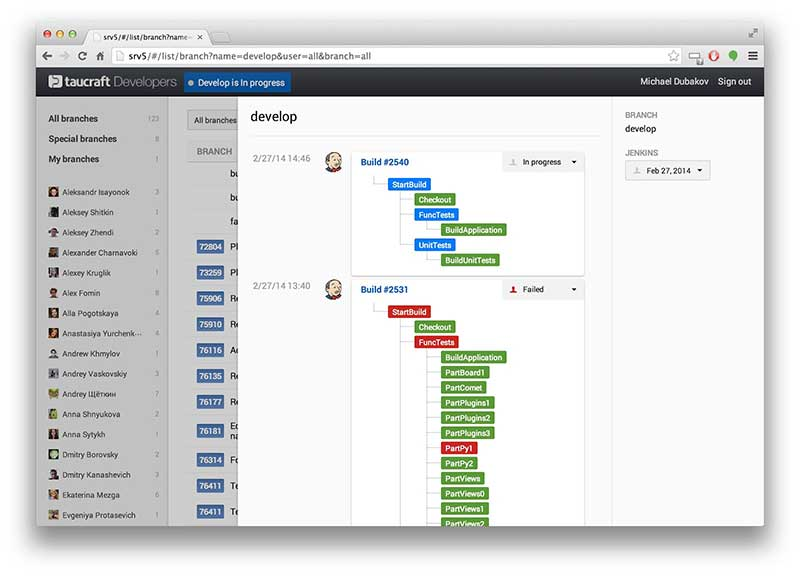

# 系統複雜性

軟體變得越來越複雜。40 年前有幾十種技術，現在我們有幾千種。更多 LOC、模組、平台。更多的一切事物。

複雜性是不可避免的，這即是演化的運作方式。人類比起病毒要複雜得多（不過這不代表人活得比較好）。我們使用複雜軟體能辦到的越來越多，所以我們必須與之共存。複雜性不會消失。開發者應該建構盡可能簡單的系統，但並沒有比較簡單。

不必要的複雜性是個巨大的阻礙。更難增加新的功能、發現並修復臭蟲，更難以理解「這裡他媽的怎麼回事！」。如同我們已經討論過的，良好的技能讓人得以建構較不複雜的系統。而新手開發者則傾向創造脆弱、過於複雜的解法。舉例來說，他們喜愛義大利麵程式，並將所有東西都擺在單一個檔案裡頭：HTML、Javascript、ASP.NET 與 C# 程式 — 全在一起！單一檔案聽起來可能比 4 個檔案還簡單，但它更難以修改與擴充。

是什麼讓軟體更複雜呢？

## 技術債 {#technical-debt}

如同你可能知道的，技術債的概念是由 Ward Cunningham 所創造的。技術債是一種實作沒那麼好的解法、或是寫出沒這麼好的程式以更快釋出軟體的**刻意**決策。假如你做了爛解法，而且沒有意識到你寫了爛程式 — 這並不是技術債，只是個爛架構罷了。假如你沒有意識到付出了代價，它就不是債。

許多人認為技術債一直都很糟。但並不是這樣的。以金錢的直接類比顯示了負債（有時）是沒問題的。所以有**一些**技術債也還可以。Ward Cunningham 本人支持這種觀點：

> 「我認為借錢是個好點子。我認為把軟體趕出門外，以此取得一些經驗是個好點子。」

技術債可以在短期內提升速度，但它增加了系統複雜度，而這會拖慢你。總是有個要意識到的權衡。如何處理技術債？第一，它必須以某種方式追蹤。每個關於技術債的決策都應該如同使用者故事（user story）或其它類似的東西一樣被文件化。這有助於理解你已經借了多少。在某個時刻，你也許會納悶「為何我們他媽的要原地踏步？」。但看看巨大的待辦清單（backlog）充滿著帶著「技術債」標籤的使用者故事，很顯然出了什麼問題。在這個時間點，唯一的選擇就是停下來，並償還債務。連帶著利息。

第二，每項關於借款的決策都應該被徹底考慮。產品負責人說「嘿，我們在兩週內就需要這個功能，偷工減料吧，各位」是很容易而且吸引人的。每一位好的開發者都有完全的責任去解釋這項決策將會導致的所有後果。作為一位軟體開發者，提出立論並定義良好的架構是你的職責。最後，你們會有個協議，但有個深思熟慮的決策是好得多的。

第三，技術債應該透過重構或是全部重寫來減少。這些活動可以是週期性（定期）或臨時的。

Steve McConnell 對技術債[提出了一個驚人推論](http://www.construx.com/10x_Software_Development/Technical_Debt/)

> 「技術債的其中一個重要暗示是，它必須要支付利息。即，一旦你欠了債，就會有利息費用。假如債務長得夠大，最終公司將會花更多的成本在償還債務，而不是投資在提升它其它資產的價值。」

技術債能被量化嗎？[似乎可以](https://www.sig.eu/files/en/084_icsews11mtdfull-p005-nugroho-1_1.pdf)：

> 技術債為修復軟體系統中的品質問題，以達到一個理想品質水準的成本。

下圖顯示了技術債，以及在不清償的情況下，它隨著時間成長的利息。成長或快或慢，視債務的累積速度而定。總而言之，一個系統中總是會有一些技術債，而不欠債在經濟上是不切實際的，它會拖慢新功能的交付。Henrik Kniberg 對技術債也有一個有意思的看法。

## 重構 {#refactoring}

重構是降低系統複雜度與償還技術債的一種自然方法。然而，在沒有自動測試的情況下是不可能重構的。我無法想像任何沒有自動測試的重要系統。少了單元／整合測試的開發就像是穿過橫跨一座深淵的燃燒的橋。沒有方法可以回頭。長遠來看，沒有自動測試的大型系統幾乎是注定失敗的。

自動測試給予你溫暖的信心 — 你能改一點點程式，並且保持系統正常運作。這就是重構了。有些極為罕見的案例，是你可能不會建立自動測試的：

1. 非產品程式（雛形、快速腳本）。
2. 你 100% 確定程式中不會有任何修改，而且沒有人會在釋出之後維護這個解決方法。在所有其它的情況下，自動測試都是非常有幫助的。

若是重構這麼棒，我們能一直重構嗎？當然不行。*重構是一種非增值活動。*當你重構系統時，你不會增加任何業務價值。你降低了複雜性、償還技術債 — 是的，但客戶什麼也沒得到。業務價值由新的程式產生。我們能一次就寫出完美的程式並創造完美的解法嗎？我希望我們可以。但我們不行。此外，需求會改變，最初的決策會不再適合。這就是我們必須迭代與重構的原因了。

## 緩慢與不穩定的自動測試 {#slow-or-unstable-automatic-tests}

自動測試很棒，但它們可能真的很難搞。想像你有個巨大的系統，而且它花費 24 小時來執行自動測試。重構就不再有趣了。是的，你會發現出了什麼問題，而且能夠解決問題，但回饋週期變得太長了。數分鐘很棒，數小時可忍受，數天......幾乎毀滅了自動測試的有用性。

另一種不好的情況是測試不穩定。「它在我的機器上能跑」是個經典的理由，但這個理由是幾乎不會被接受的。不穩定的測試令人抓狂。建置亮紅燈是因為我們真的犯了錯，還是因為不穩定？我們能將這次建置標為「粉紅色」然後發佈嗎？

老實說，在 Targetprocess 中，我們兩種問題都有。緩慢的測試部分地由平行化解決。現在我們有 60 台虛擬伺服器來執行所有的測試，但仍然有測試的執行花了 90 分鐘（包含單元測試、整合測試與功能 UI 測試）。我們已經實作了一套整合 Jenkins、Git 與 Targetprocess 的內部系統：

測試穩定性的問題非常難以解決。某些功能自動測試極為不穩定，並且難以找出問題的根源。我們在測試穩定與重寫上花了大把的時間，但我們仍然有一些不穩定的測試。

系統複雜性令自動測試更難，並使所有的開發變得更加緩慢。所以這裡是一個非常討厭的回饋循環。

## 牛仔式程式撰寫（Cowboy Coding） {#cowboy-coding}

許多開發者不喜愛流程。雖然有些人喜歡，但一般而言，他們大多享受自由、不喜歡規則。有經驗的開發者理解某些規則是真的需要的。牛仔式程式撰寫者直接忽略開發流程，並隨著他們想要地向前移動。這並不總是不好的。假如你獨自工作，或者是在一個小團隊，這是可以的，但在任何重要的開發團隊中，它會招致更多的複雜性與更多的混亂。

[牛仔式程式撰寫者](http://c2.com/cgi/wiki?CowboyCoder)傾向偷工減料，並盡可能快地往前移動。我曾是個牛仔式程式撰寫者。我喜歡看到一個被實作的解法，而且我傾向為了這個目標犧牲程式品質。現在，我理解良好工程實務的重要性，以及所有這種「牛仔式程式撰寫」風格產生的問題了。

在任何有 20+ 人的公司，都該有個被定義的開發流程。舉例來說，極限程式設計（Extreme Programming）是個高度紀律化的流程。它需要全神貫注，但最終提供了優秀的速度與程式品質。
