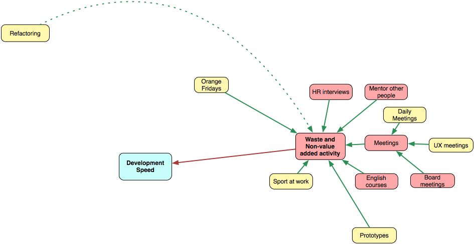

# 浪費與非增值活動

我們已經談過像 Facebook 或 Skype 這類使人分心的東西。然而，有許多危險的活動看起來就像真正的工作，但最終不會產生任何價值。

## 會議

大多會議都爛透了。以下是我在某本書讀到的一個良好會議測試：

> 想想你有多常會說「哇，這是個超棒的會議！」。

我賭這沒這麼常見。較大的公司有較多的會議。小公司可能不會有會議。每一場會議都可能很浪費。每日站立會議？當然。UX 會議？為何不要。我能夠輕易地想像一場每個人都在做狀態報告，而且沒有人在乎其它人講了什麼的完全浪費的每日會議。我出席過許多超級無聊而且毫無產出的 UX 會議。

有很多關於有效率的會議的書。你知道嗎？它們真的有用。每場會議都應該有議程表、有準備的參與者、良好的促進、誠實與公開的討論、以及明確的結果。

我們無法完全拋棄會議，良好的會議有趣而且有幫助。這是個你能夠與其它人討論問題、專注而且充分地融入討論的活動。我認為會議在發想點子上糟透了，但它們對於點子篩選是很有用的。[頭腦風暴（brainstorming）不是發明新點子的最好方法](http://davebirss.wordpress.com/2008/06/23/10-reasons-why-brainstorming-sucks/)。我信仰獨處、專注思考與時間。

要產生新東西，你必須花時間並思考。

相信你能夠毫無準備地參與會議並解決問題是很天真的。

## 工作時運動

我希望越來越多公司會信任人。我希望現在像這種場景是很罕見的：

*經理在早上 11 點來到廚房，看到兩位開發者在啜飲咖啡、相互聊天、因著什麼事而笑了起來。經理氣得發紫並大喊「你們他媽的在這裡幹嘛？我們這週五有個期限耶！」開發者立刻扔下杯子，然後離開。*

糟透了......工作不該是個人們寫程式、測試、然後釋出東西的無聊場所。有創造力的工作需要體力活動、暫停、與談話。在辦公室有桌球、訓練器材、瑜珈／跳舞／諸如此類的課程（當然還有一間淋浴間）是很好的。鍛鍊有助於降低壓力程度，最終幫助人們更有生產力。

你真的認為有人會把工作完全換成網球、踢球、或其它什麼的嗎？如果是的話，你有很嚴重的問題。或許他們被他們上個月的任務弄得很厭煩。或者你可能聘了錯的人。總之，這是有某些壞事發生的一種表現形式。

所以在工作時運動很好。你可能認為這種時間是一種浪費，但並不是這樣。

## 工作時學習

每間軟體開發公司都想要擁有學習新東西的人。儘管如此，卻沒有那麼多公司會提供學習新東西的機會。我們已經在先前的章節中討論過學習，但某些公司認為工作時學習是一種浪費。實際上，它不會產生任何價值，所以這個活動是非增值的。在軟體開發中，我們應該專注在「更聰明地工作，而非更努力地工作」，而從這個角度看，工作時學習會變得非常讓人感興趣。

我們能夠評估 Orange Fridays 的結果嗎？書籍呢？研討會呢？業餘專案（side project）呢？真的很難。結果是長期的（數年）。沒有明確的模型來將知識量化成金錢。
