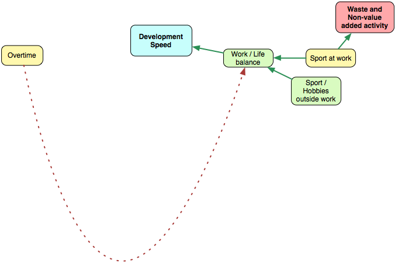

# 工作／生活的平衡

這一節不會太長。我們已經提過倦怠了。軟體開發是一種你將會不斷思考的活動。當你在軟體中有個複雜的問題時，你會在任何地方思考它。它在你跟你的女朋友散步時突然跳出來，某些想法出現在淋浴間，而你的腦袋甚至試著加重了這個問題，呃，在最不恰當的時機。學習如何關機是很重要的。運動、旅行、瑜珈與嗜好都是最好的候選。

公司應該鼓勵大家有一些嗜好、並支持它們。對體育活動也是如此。

零加班規則應該由上層主管宣傳。若是你在某個時刻工作得越來越拼命，你會工作得越來越笨。
