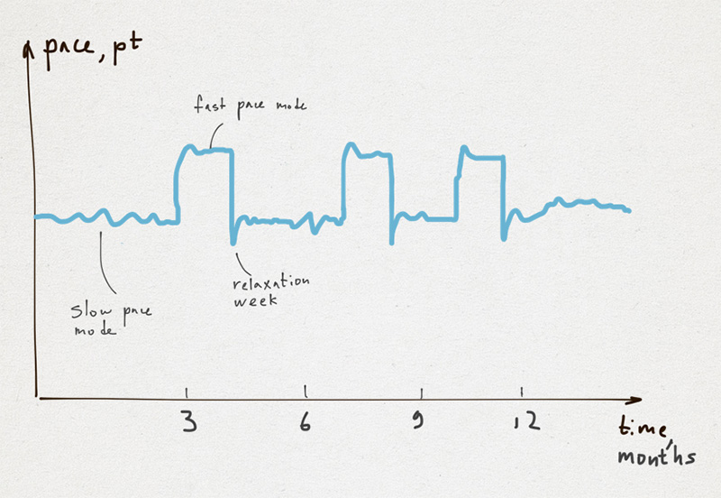

# 衝刺、馬拉松以及......間歇跑！

乍看之下，僅有三種選擇。

## 選項 1，極限衝刺（Extreme Sprint）

你能夠 12-14 小時／天全速奔跑，以能量飲料、咖啡因、糖、誰知道還有什麼作為燃料。你能夠熬夜工作、睡少量幾個小時，並在飲食、盥洗、運動等等上花費最少的時間。我會給你一個月。假如你處於完美狀態，可能三個月。這種模式的好處是，所有人都知道它有多糟。很快就燃燒殆盡了。

### 旁註

我知道一個一整年以這種模式工作的人！他學了很多東西並大大地提升了能力，但這並不是毫無代價的。他目前的健康問題很可能就是這種極限衝刺模式所造成的。拿健康換經驗是個好主意嗎？我不這麼認為。

## 選項 2，中等衝刺（Moderate Sprint）

你能夠工作 8-10 小時／天，榨出每一分生產力。沒有閒聊、不在工作時運動、沒有樂趣。有些公司在令工作有趣、有挑戰性、以及有趣這點上無所作為。專案總是延誤，每個人總是處於壓力下。不幸的是，這個模式可能持續多年。人們可能習慣它，並且不去注意他們有多悲慘。他們試著在家中，以家人和嗜好尋求補償。這是一個真正的威脅，因為這樣工作幾個月之後，生產力會往下掉，而且沒有人會注意到。深入思索自身並有一些洞見可能會花上許多年。

## 選項 3，馬拉松（Marathon）

這種模式看起來最好。你 6-8 小時／天把工作做到最好，找出時間放鬆與鍛鍊。你不會緊抓每一分鐘，而且擁有思索一個問題一段時間的樂趣。不會急著**現在**就把東西推出門外！聽起來不錯。然而，許多管理者並不滿足於馬拉松步伐。他們想要快一點把東西交付出去。我相信這種純粹的模式在現實中是相當罕見的。在大多數公司中，管理者會試著加快做事的速度，而且是以最愚蠢的方式來做，使用加班、塞任務、以及「我們是英雄」的激勵。

乍看之下，似乎沒別的了。但我想我們還有一個選項。老實說我從未聽過它。

## 選項 4，間歇跑（Intervals）

我並不是在講迭代開發（Iterative Development）。事實上，迭代開發也能夠平等地套用在中等衝刺與馬拉松模式上。間歇開發是在你混合模式的時候。你可以在一段很短的時間內衝刺，然後切換到馬拉松模式。在我看來，良好的時程可能是：

- 1 個月 - 快步衝刺
- 3 個月 - 馬拉松
- 1 個月 - 快步衝刺
- ...

容我解釋一下我所指的快步模式（Fast Pace Mode）。在這種模式下，團隊（或者一整間公司）會停止一切次要活動：所有關於未來的會議、學習活動、HR 活動、等等。團隊專注於提供價值：寫程式、測試、建立文件、以及交付成果。

快步模式以放鬆週作結。這週奉獻給重構、討論以及關於未來的想法。

好處很清楚 — 平均步伐會比馬拉松模式還大。有正統馬拉松週期尾隨其後的快步模式並不會有很大壓力。此外，當團隊捲起他們的袖子，把鳥事搞定（get shit done）並快速交付時，它可能是個激勵人心的活動。當你交付什麼時 — 它令你感覺良好。這是一個成就、一個里程碑。這是個麻醉劑。或許這就是為何人們有時能以極速模式工作的原因。
