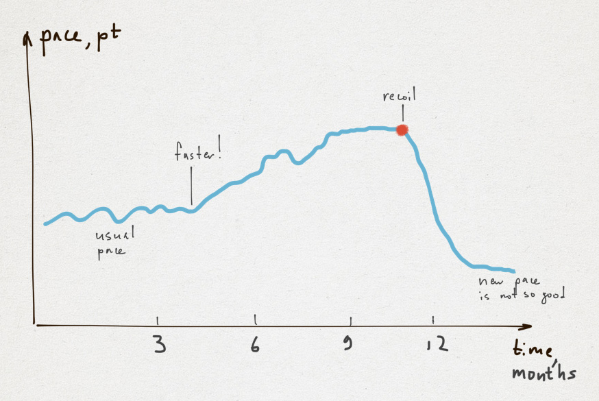

# 速度的兩端

許多人傾向將速度想成一個單一的本質，但它並非如此。有兩種非常不同的速度：短期速度（衝刺）與長期速度（馬拉松）。衝刺對上馬拉松在這是個完美的類比。在軟體開發中（以及執行中），你無法同時具備兩者。讓我們拿一些像點數這類抽象的努力單位來說。在衝刺模式下全速運作，你每個月交付了 100 點。這是我的第一個論點：

在一條漫長的產品開發路途上，你無法維持衝刺的步伐。

或許你能維持 100 點／月的步伐 3-6 個月，但你能這樣做一年卻是非常不可能的。此外，反作用會隨著高速開發顯著增長。並且某一天，你會對一切感到後悔。

在某個時間點，大多開發者都會到達一個「幹點（fuck it point）」（紅點）並大大地降低產能。

你的目標是以盡可能大的步伐跑一段非常長的距離（數年），你需要耐力與平穩。

如何在更長的時間中更快地創造軟體呢？這是個「百萬美元」問題。對於每間公司，答案很可能都是獨一無二的，但我們仍然能夠建構一個有用、合理的粗糙模型。
