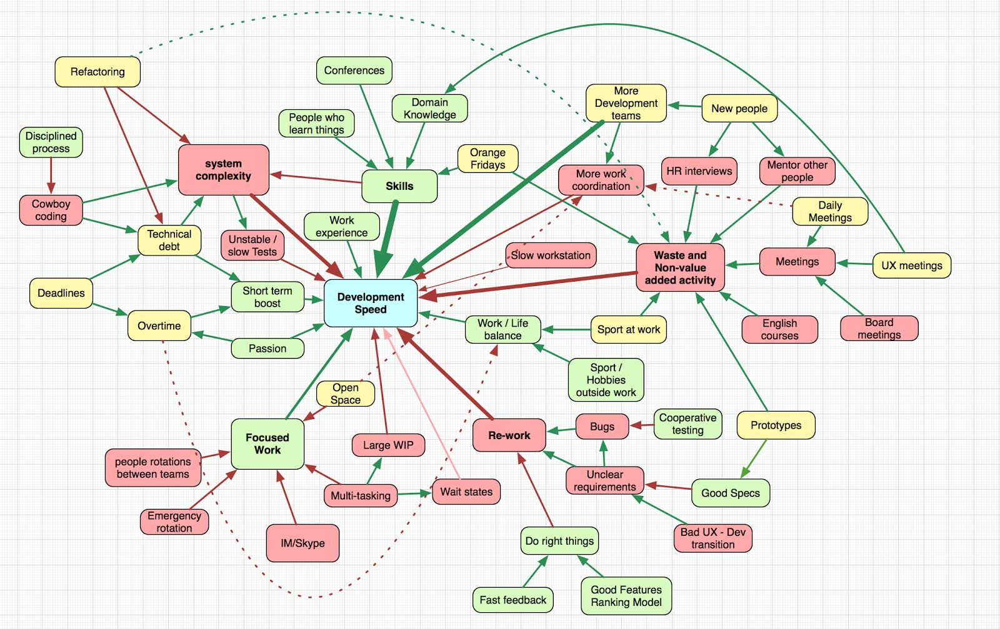

# 總結

我認為強調某幾點會很有用。

**軟體開發步伐**／**生產力**／**速度是一個複雜、相互依賴而且多面向的概念**。它沒有簡單的解法。你不能對著人大喊「做快一點！」。你不能盲目地偷工減料，只專注在增加價值的活動。唯一的解法是深入地思考公司、開發流程、人、工具、等等。建構一個模型並思考。

我很想進一步發展間歇開發的概念。它對我來說非常有趣，而且很可能是良好步伐與良好耐力的適當平衡。馬拉松與中等衝刺混合的類比開展了許多探索的新方向。

關於這個模型還有一些話要說。

在這個模型上加上權重是很令人感興趣的。有些活動大大地影響速度，其它的則沒有那麼多。每間公司都有獨一無二的權重，但若是我們能夠以某種方式定義它們，我們就能專注在最重要的事物上。

感謝你的撥空閱讀。

*P.S. 我很好奇這篇文章能夠被延伸成一本書嗎？嗯......*

*P.P.S. [Reddit 的討論](http://www.reddit.com/r/programming/comments/27giwz/speed_in_software_development_a_great_article/)*
